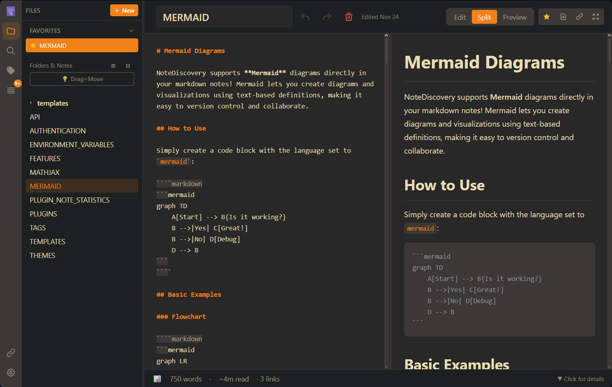

# GoNote


> Your Self-Hosted Knowledge Base

## What is GoNote?

GoNote is a **lightweight, self-hosted note-taking application** that puts you in complete control of your knowledge base. Write, organize, and discover your notes with a beautiful, modern interface-all running on your own server.



## Tech Stack

| Component | Technology |
|-----------|------------|
| **Backend** | Go 1.24+ with Fiber |
| **Frontend** | Vanilla JS + Alpine.js |
| **Storage** | Plain Markdown files |

## Who is it for?

- **Privacy-conscious users** who want complete control over their data
- **Developers** who prefer markdown and local file storage
- **Knowledge workers** building a personal wiki or second brain
- **Teams** looking for a self-hosted alternative to commercial apps
- **Anyone** who values simplicity, speed, and ownership

---

<p align="center">
  <a href="https://www.gonote.com"></a>
  &nbsp;&nbsp;
  <a href="https://gamosoft-gonote-demo.hf.space"></a>
</p>
<p align="center">
  <a href="https://www.pikapods.com/pods?run=gonote"></a>
  &nbsp;&nbsp;
  <a href="https://ko-fi.com/gamosoft"></a>
</p>

---

## Why GoNote?

### vs. Commercial Apps (Notion, Evernote, Obsidian Sync)

| Feature | GoNote | Commercial Apps |
|---------|---------------|-----------------|
| **Cost** | 100% Free | $xxx/month/year |
| **Privacy** | Your server, your data | Their servers, their terms |
| **Speed** | Lightning fast | Depends on internet |
| **Offline** | Always works | Limited or requires sync |
| **Customization** | Full control | Limited options |
| **No Lock-in** | Plain markdown files | Proprietary formats |

### Key Benefits

- **Total Privacy** - Your notes never leave your server
- **Optional Authentication** - Simple password protection for self-hosted deployments
- **Zero Cost** - No subscriptions, no hidden fees
- **Fast & Lightweight** - Instant search and navigation
- **Beautiful Themes** - Multiple themes, easy to customize
- **Extensible** - Plugin system for custom features
- **Responsive** - Works on desktop, tablet, and mobile
- **Simple Storage** - Plain markdown files in folders
- **Math Support** - LaTeX/MathJax for beautiful equations
- **HTML Export** - Share notes as standalone HTML files
- **Graph View** - Interactive visualization of connected notes
- **Favorites** - Star your most-used notes for instant access
- **Outline Panel** - Navigate headings with click-to-jump TOC

## Quick Start

### Quick Setup

**Linux/macOS:**
```bash
mkdir -p gonote/data && cd gonote
docker run -d --name gonote -p 9000:9000 \
  -v $(pwd)/data:/app/data \
  ghcr.io/gamosoft/gonote:latest
```

**Windows (PowerShell):**
```powershell
mkdir gonote\data; cd gonote
docker run -d --name gonote -p 9000:9000 `
  -v ${PWD}/data:/app/data `
  ghcr.io/gamosoft/gonote:latest
```

Open **http://localhost:9000** - done!

> Your notes are saved in `./data/`. Themes, plugins, locales and default configuration values are included in the image.

### Using Docker Compose

Two docker-compose files are provided:

| File | Use Case |
|------|----------|
| `docker-compose.ghcr.yml` | **Recommended** - Uses pre-built image from GitHub Container Registry |
| `docker/compose/development.yml` | For development - Builds from local source |

**Option 1: Pre-built image (fastest)**

Linux/macOS:
```bash
mkdir -p gonote/data && cd gonote
curl -O https://raw.githubusercontent.com/gamosoft/gonote/main/docker-compose.ghcr.yml
docker-compose -f docker-compose.ghcr.yml up -d
```

Windows (PowerShell):
```powershell
mkdir gonote\data; cd gonote
Invoke-WebRequest -Uri https://raw.githubusercontent.com/gamosoft/gonote/main/docker-compose.ghcr.yml -OutFile docker-compose.ghcr.yml
docker-compose -f docker-compose.ghcr.yml up -d
```

**Option 2: Build from source (for development)**
```bash
git clone https://github.com/gamosoft/gonote.git
cd gonote
docker-compose -f docker/compose/development.yml up -d
```

See [Advanced Docker Setup](#advanced-docker-setup) for volume details.


### Running Locally (Without Docker)

For development or if you prefer running directly:

```bash
# Clone the repository
git clone https://github.com/gamosoft/gonote.git
cd gonote/go

# Run the application
go run cmd/server/main.go

# Access at http://localhost:9000
```

**Requirements:**
- Go 1.24 or higher

#### Build from Source

```bash
cd gonote/go

# Download dependencies
go mod download

# Build
go build -o gonote ./cmd/server

# Run
./gonote
```

### Advanced Docker Setup

The image includes bundled config, themes, plugins, and locales. To customize, you must:
1. **Map the volume** in your docker-compose or docker run command
2. **Provide content** - the file/folder must exist with valid content (empty = app might break!)

| Volume | Purpose | Bundled? |
|--------|---------|----------|
| `data/` | Your notes | No - You must create |
| `config.yaml` | App settings | Yes |
| `shared/themes/` | Custom themes | Yes |
| `shared/plugins/` | Custom plugins | Yes |
| `shared/locales/` | Translations | Yes |

### Dashboard Integration

<a href="https://cdn.jsdelivr.net/gh/homarr-labs/dashboard-icons@master/svg/gonote.svg" target="_blank">
  
</a>

An official icon for GoNote is now available on [Dashboard Icons](https://dashboardicons.com/icons/gonote)!  
Use it in your self-hosted dashboards like Homepage, Homarr, Dashy, Heimdall, etc...

## Documentation

Want to learn more?

- **[THEMES.md](project-docs/user-guide/THEMES.md)** - Theme customization and creating custom themes
- **[FEATURES.md](project-docs/user-guide/FEATURES.md)** - Complete feature list and keyboard shortcuts
- **[TAGS.md](project-docs/user-guide/TAGS.md)** - Organize notes with tags and combined filtering
- **[TEMPLATES.md](project-docs/user-guide/TEMPLATES.md)** - Create notes from reusable templates with dynamic placeholders
- **[MATHJAX.md](project-docs/user-guide/MATHJAX.md)** - LaTeX/Math notation examples and syntax reference
- **[MERMAID.md](project-docs/user-guide/MERMAID.md)** - Diagram creation with Mermaid (flowcharts, sequence diagrams, and more)
- **[PLUGINS.md](project-docs/user-guide/PLUGINS.md)** - Plugin system and available plugins
- **[API.md](project-docs/developer-guide/API.md)** - REST API documentation and examples
- **[AUTHENTICATION.md](project-docs/security/AUTHENTICATION.md)** - Enable password protection for your instance
- **[ENVIRONMENT_VARIABLES.md](project-docs/developer-guide/ENVIRONMENT_VARIABLES.md)** - Configure settings via environment variables
- **[SECURITY.md](project-docs/security/SECURITY.md)** - Security guide and best practices

### Chinese Documentation

- **[README_CN.md](project-docs/legacy/README_CN.md)** - Go 后端文档（中文）
- **[SECURITY_CN.md](project-docs/security/SECURITY_CN.md)** - 安全指南（中文）

## Multiple Languages

GoNote supports multiple languages! Currently available:
- English (en-US) - Default
- Simplified Chinese (zh-CN)

**To change language:** Go to Settings (gear icon) -> Language dropdown.

**To add your own language:** See the [Contributing Guidelines](CONTRIBUTING.md#-contributing-translations) for instructions on creating translation files.

**Docker users:** Mount your custom locales folder to add or override translations:

```yaml
volumes:
  - ./locales:/app/locales  # Custom translations
```

**Pro Tip:** If you clone this repository, you can mount the `documentation/` folder to view these docs inside the app:

```yaml
# In your docker-compose.yml
volumes:
  - ./data:/app/data              # Your personal notes
  - ./documentation:/app/data/docs:ro  # Mount docs subfolder inside the data folder (read-only)
```

Then access them at `http://localhost:9000` - the docs will appear as a `docs/` folder in the file browser!

## Contributing

**Before submitting a pull request**, especially for major changes, please:
- Read our **[Contributing Guidelines](CONTRIBUTING.md)**
- Open an issue first to discuss major features or significant changes
- Ensure your code follows the project's style and philosophy


## Security Considerations

GoNote is designed for **self-hosted, private use**. Please keep these security considerations in mind:

### 🚨 Before Exposing to the Internet

**Complete this checklist:**

1. **Change default password** from `admin` to a strong password
2. **Generate a random secret key** for session encryption
3. **Enable authentication** (`authentication.enabled: true`)
4. **Enable rate limiting** (`rate_limit.enabled: true`)
5. **Configure CORS** with specific allowed origins (not `*`)
6. **Enable secure cookies** if using HTTPS

See **[SECURITY.md](project-docs/SECURITY.md)** for complete security guide.

### Network Security
- **Do NOT expose directly to the internet** without additional security measures
- Run behind a reverse proxy (nginx, Caddy) with HTTPS for production use
- Keep it on your local network or use a VPN for remote access
- By default, the app listens on `0.0.0.0:9000` (all network interfaces)

### Authentication
- **Password protection is DISABLED by default** (default password: `admin`)
- **ENABLE AUTHENTICATION AND CHANGE THE DEFAULT PASSWORD** if exposing to a network!
- See **[AUTHENTICATION.md](project-docs/AUTHENTICATION.md)** for complete setup instructions
- To disable auth, set `authentication.enabled: false` in `config.yaml`
- Perfect for single-user or small team deployments
- For multi-user setups, consider a reverse proxy with OAuth/SSO

### Data Privacy
- Your notes are stored as **plain text markdown files** in the `data/` folder
- No data is sent to external services
- Regular backups are recommended

### Best Practices
- Run on `localhost` or a private network only
- Use Docker for isolation and easier security management
- Keep your system and dependencies updated
- Review and audit any plugins you install
- Set appropriate file permissions on the `data/` directory

**TL;DR**: Perfect for personal use on your local machine or home network. Enable built-in password protection if needed, or use a reverse proxy with authentication if exposing to wider networks.

## License

MIT License - Free to use, modify, and distribute.

---

Made with love for the self-hosting community